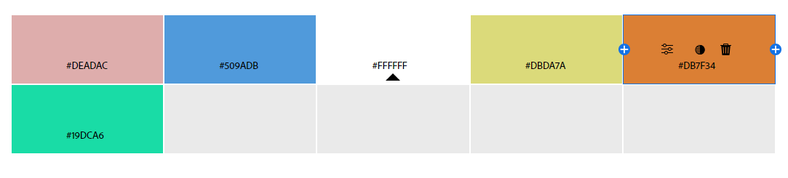

# README
Jamil Segura

I have learned a lot in this class. For me, this class introduced me to a whole new language that I am still learning. It has been a fun class and I have enjoyed in learning of what goes on behind the scenes of websites. I hae learned how photos, videos, and everything are sized and given permission to work. I have learned how to change colors and fonts to make things look good.

My bio is talking about where I am from and my goal in RVCC. I talk about my two passions, photography and cooking.

Citations for Research

Tam VincentTam spends her time developing content for FooPlugins. (2024, October 24). Quickly add hover effects to images: Easy CSS guide. FooPlugins. https://fooplugins.com/thumbnail-hover-effect/#:~:text=Using%20hover%20effects%20is%20an,additional%20information%20for%20your%20users. 

TMS-Plugins, & Timotic, M. (2024, January 15). 37 awesome CSS image hover effects that you can use. wpDataTables. https://wpdatatables.com/css-image-hover-effects/#:~:text=The%20Role%20of%20CSS%20Image%20Hover%20Effects,-Interactivity%20is%20an&text=This%20is%20where%20CSS%20image,website%20without%20slowing%20it%20down. 

adminThis author has not written his bio yet.But we are proud to say that admin contributed 70 entries already.
More Posts from this Author, & Admin. (2024, April 8). 10 simple div hover effects: CSS image hover effects. The Brandsmen. https://thebrandsmen.com/css-image-hover-effects/ 

https://www.youtube.com/watch?v=hr4JiDr7Aec

Copyright 2024 Jamil Segura
Jamil Segura!
